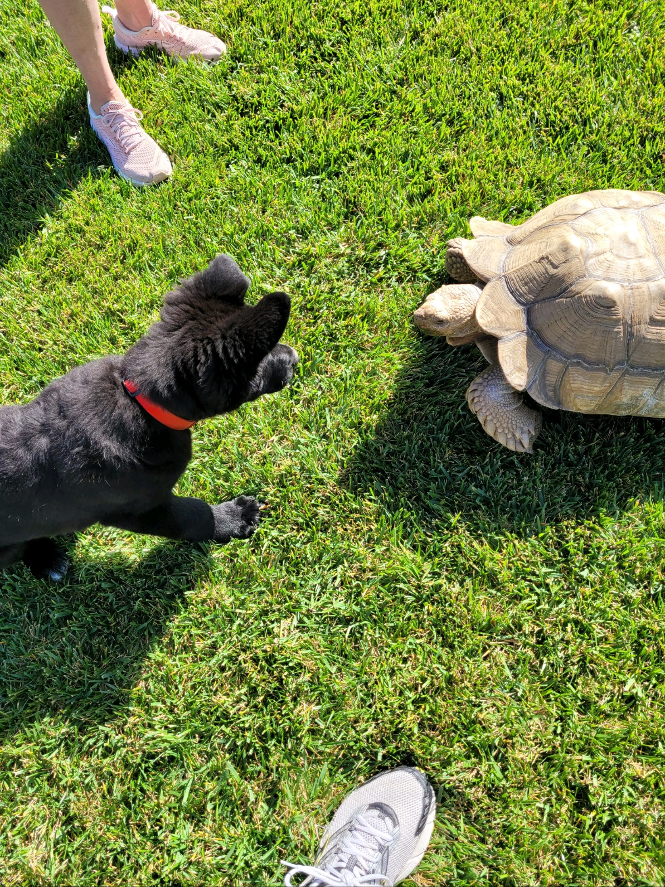
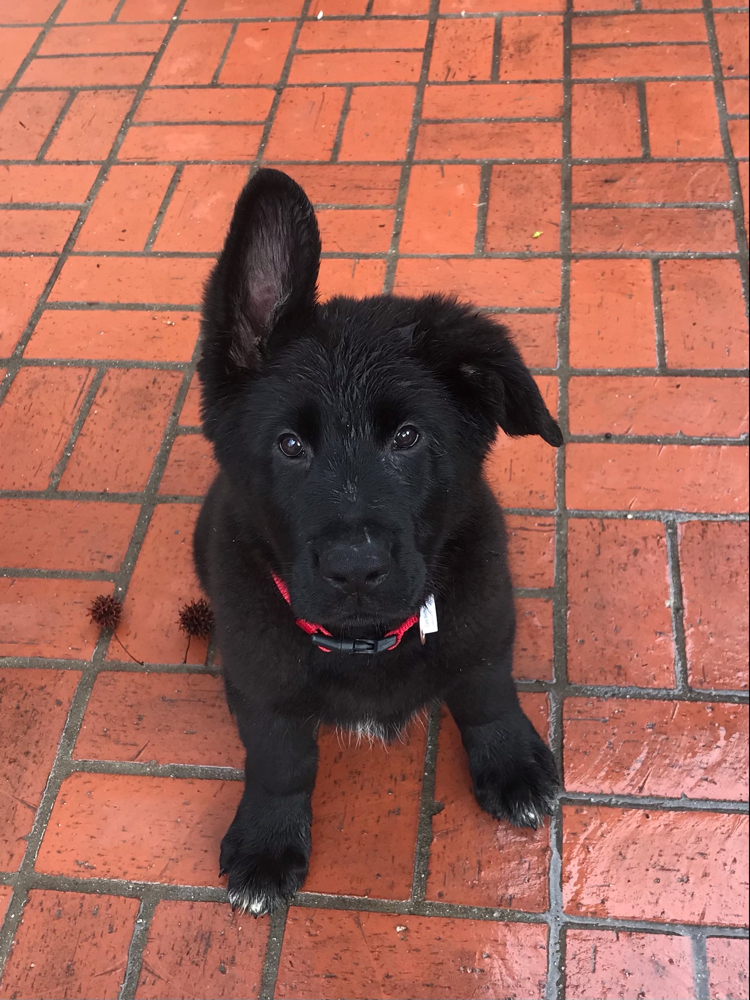
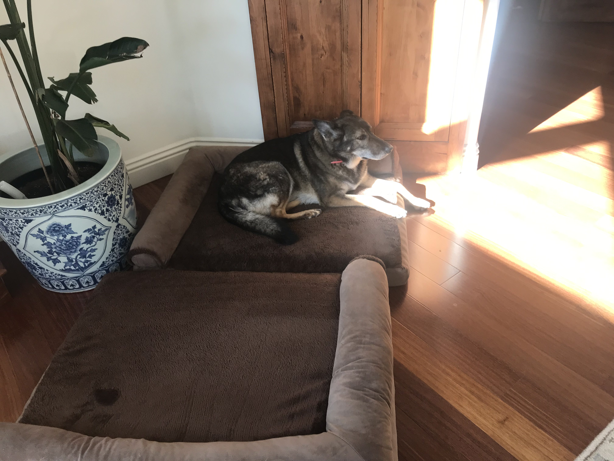
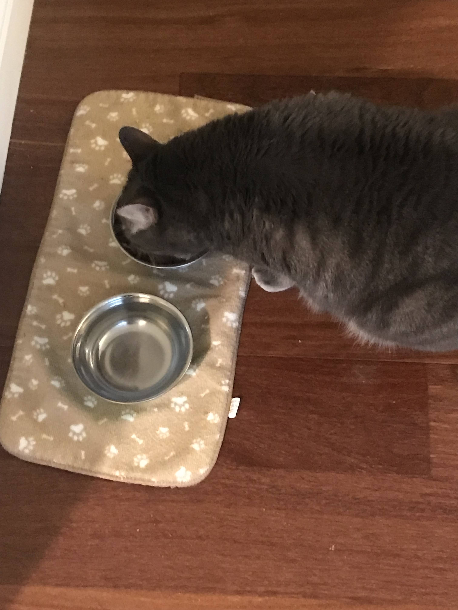

This is where you'll create your User Page, which should include content that introduces who you are as a programmer and as a person. Your User Page must be made with Markdown. For this assignment, your page must include the following:
Pictures xx
All the core Markdown constructs in GitHub Flavored MarkdownLinks to an external site.
    Headings xx
    Styling text xx
    Quoting text xx
    Quoting code xx
    External Links xx
    Section links xx
    Relative links (Link to another .md file or an image in your repo. If linking to an image, encode it as a regular link rather than an image.) xx
    Ordered and Unordered Lists xx
    Task lists x

### Rocky Hankin Lore Sheet

[Skip to programming](#who-am-I-as-a-programmer)

## Who am I? 


Hi. My name is Rocky Hankin. I like writing and have an Ao3 account. I have trouble forcing myself to smile so I used my resting face. I'm not that expressive and a recluse. I've lived about half my life in California and the other half in North Carolina. I've seen a lot of different countries and cities, from Beijing, to Florence, to New York. Honestly, I feel like the trips were wasted on me. The person I was back then couldn't really appreciate it.

My family has two dogs, one cat, and one turtle. The turtle's not really a pet, he's just always been there on the property, but we put out a water bowl out for him.





My mom likes to name animals after greek characters so the turtle is named Atlas, the black dog's name is Zeus and his middle name is Apollo. The older dog's name is Astra and her middle name is Zenica, I named her that, but mom says her middle name is Hera but she's wrong and dumb don't listen to her. The cat's name is Rover because my sister named him and he's weirdly friendly for a cat.

I like dogs. They're better than people.

Most of the music I like was written before I was born, which isn't any criticism of modern music, just an observation. This is my [playlist](https://open.spotify.com/playlist/24jx3xpYqp2OwWWx8BfcHM?si=oyNM2M2VT0iPRQ-7noHV2A&pi=u-ba9Xw9q5SH2s)

My favorite songs are
1. Civil War (guns and roses)
2. Tribute (Tenacious D)
3. Red Sun (Metal Gear Rising: Revengence)
*placing tribute at the number one spot is against local and federal legal codes. Iykyk.

My favorite song lyrics are

> I shouted out
> 'Who killed the Kennedy's?'
> When after all
> It was you and me
*-Sympathy for the Devil*

Another favorite is

> And the beast was done
> He asked us,
> "*snort,* be you angels?"
> And we said "nay!"
> "We are but men!"
*-Tribute* <br>
I have since been informed this is an innuendo.

I also like anime & manga, strategy games, pirates, and the indomnitable human spirit.


## Who am I as a programmer?

Man, Idk dude. I might as well just copy paste stuff from my resume. Man, I might as well upload my resume to the github and [link to it](Rocky_Hankin_Resume.pdf). There we go, that saves me a little time. Joke's on you, this is gonna be another personal segment.

I started programming in the 6th grade because I'd decided I wanted to make videogames when I grow up. Personally, I'm not so sure about that now. I've heard a lot of bad things about the industry, but I look. Even if its only as an amateur or a hobbyist. There is good, creative work that can give my life meaning no matter what my profession is, whether that's coding or writing. That said, I'm already pretty deep on this path and it looks like its gonna work out for me.

I've got
-[x] internship lined up
-[x] foot in the door
-[ ] fully completed coursework

I think my greatest strength in programming and life in general is my capacity for self critique and laid back perspective. I value "improvement" over "winning" 100% of the time. I value being a person that I am proud of over everything.

```
print('Hello world\n');
```

You're still here? What are you doing here? Go look at [Zeus](FullSizeR.jpeg).

1. ordered
2. list

- unordered
- list

- [x] task
- [ ] list
code block
```
{
  "firstName": "John",
  "lastName": "Smith",
  "age": 25
}
```

> quote text

section link
[click on this link](#my-multi-word-header)
### My Multi Word Header
